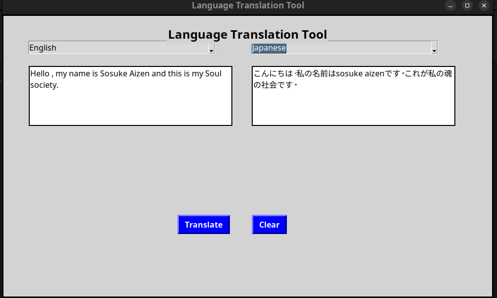

# CodeAlpha_Language_Translation_Tool

A simple language translation tool that translates text from one language to another using a simple python tkinter interface and google translation API .

## Table of Contents

- [Features](#features)
- [Getting Started](#getting-started)
- [Cloning the Project](#cloning-the-project)
- [Installation Requirements](#installation-requirements)
- [How to Contribute](#how-to-contribute)
- [License](#license)

## Features

- **Language Translation**: Changes one language to another in the app.
- **Simple UI**: A nice simple UI that enables you to easily select languages and type your input.

## Getting Started

To get started with this project, follow the instructions below:

### Cloning the Project

To clone this repository, use the following command:

```bash
git clone https://github.com/Csasaka19/CodeAlpha_Language_Translation_Tool.git

cd CodeAlpha_Language_Translation_Tool
```

### Installation Requirements

This project requires Python 3.x and several libraries. You can install the necessary libraries using pip. First, ensure you have pip installed, then run the following command:

```bash
pip install -r requirements.txt
```

To run the project after all requirements are installed:
```bash
python3 interface.py
```



### How to Contribute

Contributions are welcome! If you would like to contribute to this project, please follow these steps:

Fork the repository on GitHub.
Create a new branch for your feature or bug fix:

```bash
git checkout -b feature/your-feature-name
```
Make your changes and commit them:
```bash
git commit -m "Add your message here"
```
Push to your branch:

```bash

git push origin feature/your-feature-name
```
Create a pull request to the main repository.


### License

This project is licensed under the GNU Affero General Public License. See the LICENSE file for more information.
